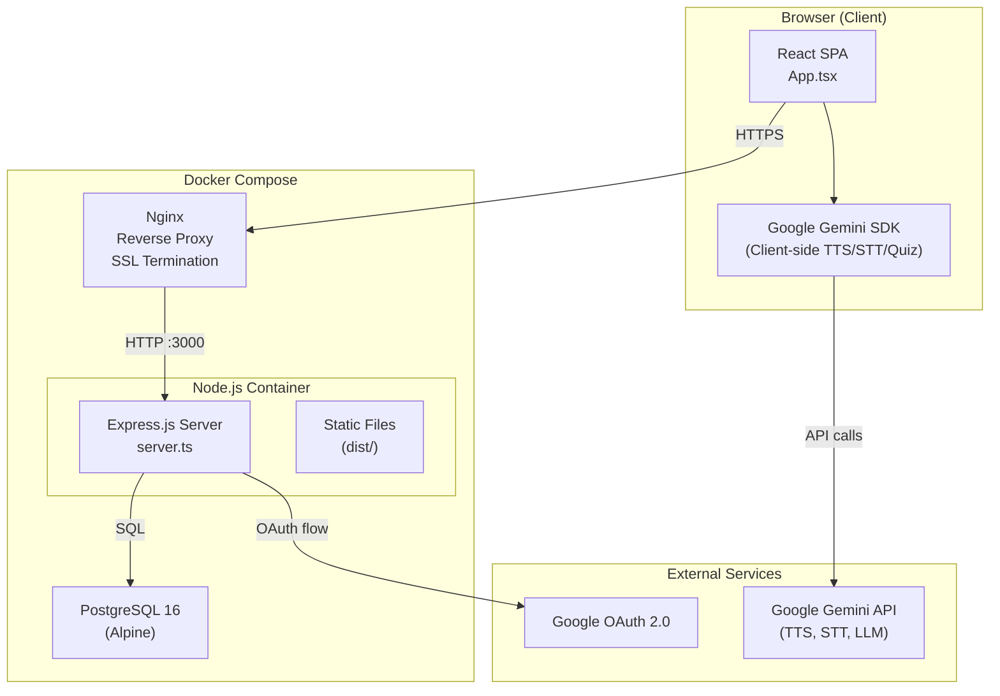
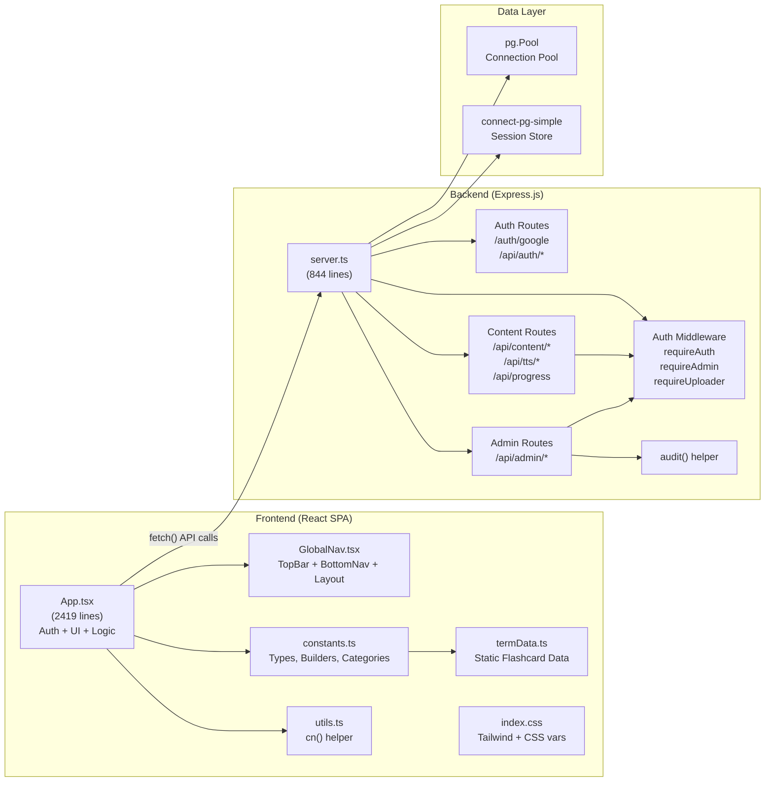
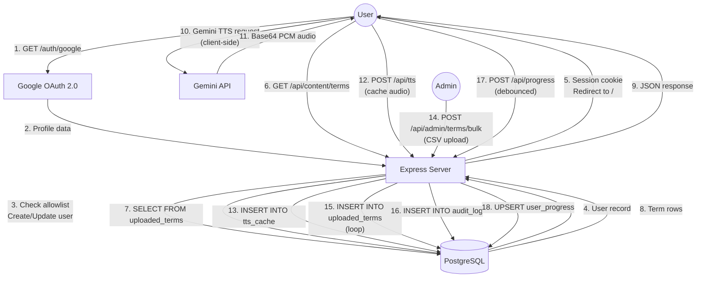
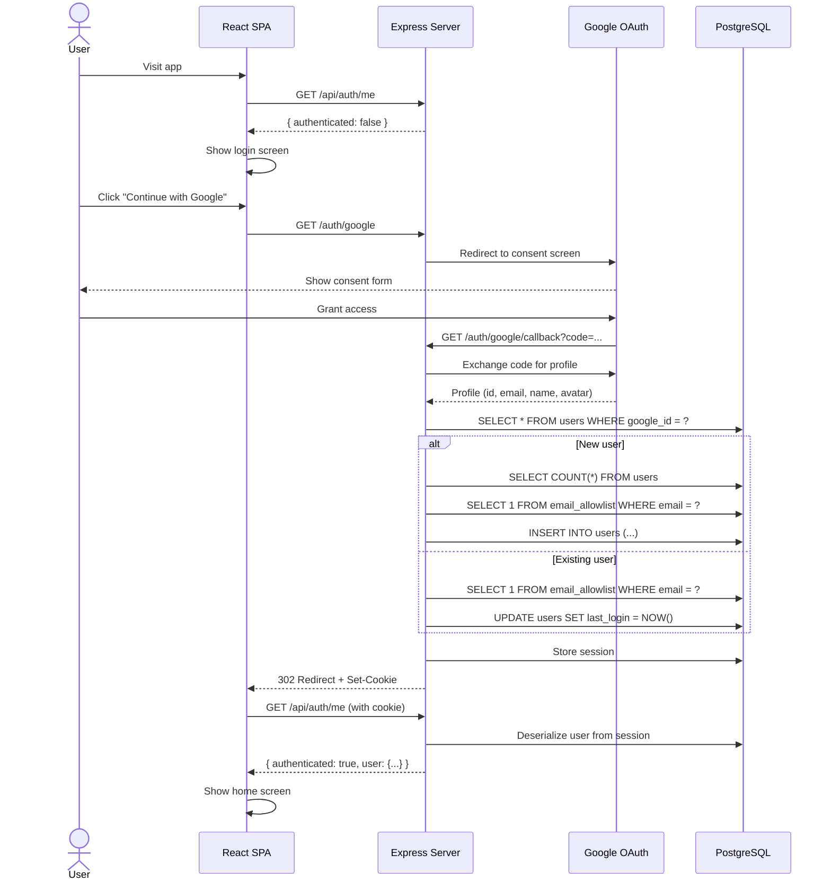
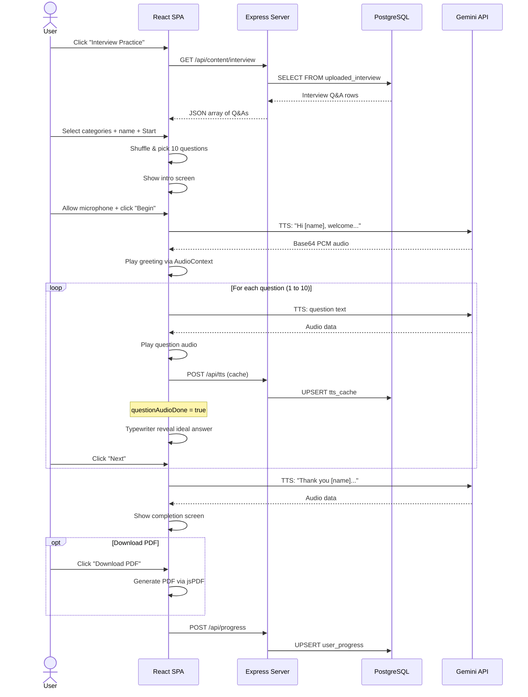
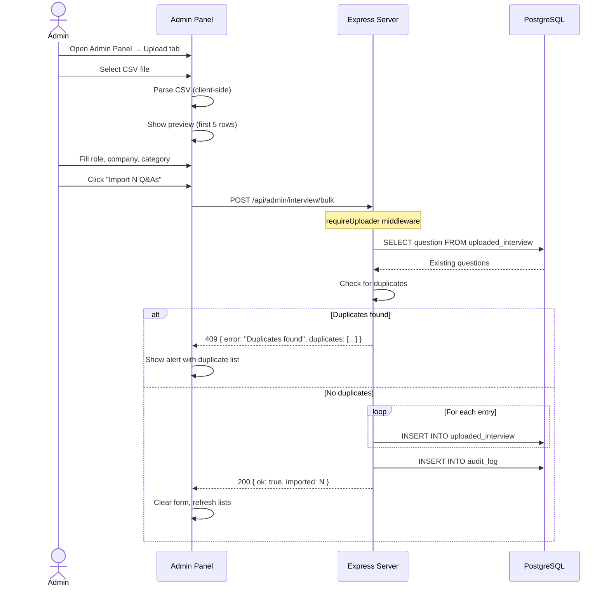
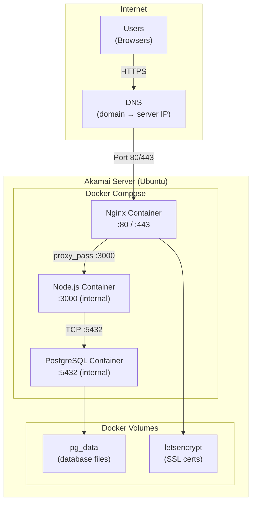
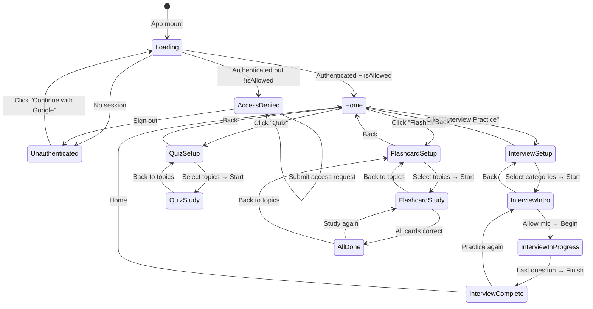

# Architecture Diagrams

All diagrams use Mermaid format and can be rendered in GitHub, GitLab, Notion, or any Mermaid-compatible viewer.

---

## 1. System Architecture Diagram

High-level view of all system components, their relationships, and external services.

---

## 2. Component Diagram

Internal modules and their dependencies.

---

## 3. Data Flow Diagram

How data moves through the system for key operations.

---

## 4. Authentication Flow Sequence Diagram

---

## 5. Interview Practice Sequence Diagram

---

## 6. Admin Content Upload Flow

---

## 7. Deployment Architecture

---

## 8. Frontend State Machine

